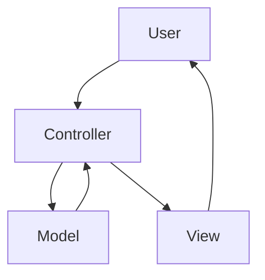

<br>

<p align="center"><a href="https://sciola-git.github.io"></a></p>

<p align="center">The Lightweight PHP Framework to Accelerate Development.</p>

# <p align="center">:warning: Under development</p>

## <p align="center">Reference</p>

<br>

### :arrow_right: Requirements

- Apache2 | https://httpd.apache.org
- Composer | https://getcomposer.org
- NPM | https://www.npmjs.com
- PHP 7++ | https://www.php.net
- DBMS - (Data Base Management System) | https://en.wikipedia.org/wiki/Database

<br>

### :arrow_right: Installation

1. [Download the framework here and unzip it in your development directory.](https://github.com/sciola-git/Sciola/archive/refs/heads/main.zip)

   Example: **/var/www/sciola**

2. Go to the packages directory and run the commands to do the installation:

   > **LINUX**
   >
   > debian@debian:~$ **cd /var/www/sciola/packages**
   >
   > debian@debian:~/var/www/sciola/packages$ **composer install**
   >
   > debian@debian:~/var/www/sciola/packages$ **npm install**

3. Give write permission to the directory: **/var/www/sciola/writable**

4. Access the application through the url that is configured on your web server.

   Example: http://localhost:8080

<br>

### :arrow_right: Directory Structure

<br>

> <a href="#-config"></a> [config](#-config)
>
> <a href="#-database"></a> [database](#-database)
>
> <a href="#-languages"></a> [languages](#-languages)
> 
> <a href="#-layers"></a> [layers](#-layers)
>
> <a href="#-libraries"></a> [libraries](#-libraries)
>
> <a href="#-packages"></a> [packages](#-packages)
>
> <a href="#-public"></a> [public](#-public)
>
> <a href="#-routes"></a> [routes](#-routes)
>
> <a href="#-tests"></a> [tests](#-tests)
>
> <a href="#-writable"></a> [writable](#-writable)

<br>

### :arrow_right: Front-end

<br>

> <a href="#ajax"></a> [Ajax](#ajax)
>
> <a href="#css"></a> [CSS](#css)
>
> <a href="#js"></a> [JS](#js)

<br>

### :arrow_right: Twig

<br>

> <a href="#filters"></a> [Filters](#filters)
>
> <a href="#functions"></a> [Functions](#functions)
>
> <a href="#layout"></a> [Layout](#layout)
>

##

<p>

### <a href="#-config"></a> config

</p>

In this directory are the application's configuration files.

##

**constant.ini**

> **Note** *In production change the **DEV_MODE** option to false.*

```ini
DEV_MODE = true
```

*to*

```ini
DEV_MODE = false
```

**php.ini**

> **Note** *PHP settings with **PHP_INI_ALL** permission.*

##

<p>

### <a href="#-database"></a> database

</p>

In this directory are the database development files used by the ORM (Object-Relational Mapping).

##

##

<p>

### <a href="#-languages"></a> languages

</p>

In this directory are the translation files of your application and the routes.

##

> **Note**
>
> *- Translation files must have the following structure: {"ID" : "Term"}*
>
> *- The translated text must have the same ID in all translation files. Example:*


### Text translation

File: **en/app.json**

```json
{
  "A0001" : "Hello World!",
  "A0002" : "Welcome",
  "A0003" : ""
}
```

File: **pt-BR/app.json**

```json
{
  "A0001" : "Olá Mundo!",
  "A0002" : "Bem-vindo",
  "A0003" : ""
}
```

### Route translation

File: **en/routes.json**

```json
{
  "B0001" : "products-and-services",
  "B0002" : "virtual-store",
  "B0003" : "contact"
}
```

File: **pt-BR/routes.json**

```json
{
  "B0001" : "produtos-e-servicos",
  "B0002" : "loja-virtual",
  "B0003" : "contato"
}
```

> **Note** *You will be able to rename the files and create others with custom names according to the context of your application. Example:*

File: **en/system.json**

File: **en/system-routes.json**

File: **en/website.json**

File: **en/website-routes.json**

<br>

File: **pt-BR/system.json**

File: **pt-BR/system-routes.json**

File: **pt-BR/website.json**

File: **pt-BR/website-routes.json**

##

**Call the function to translate into:**

**PHP**
```php
<?php
  translate('Term in english...');
?>
```

**Twig**
```twig
{{ translate('Term in english...') }}
```

**JS**
```javascript
<script>
  translate('Term in english...');
</script>
```

<p>

### <a href="#-layers"></a> layers

</p>

In this directory are the layers of the **MVC** pattern. [ **Model** | **View** | **Controller** ]

##



## Controller

File: **MyController.php**

```php
<?php

namespace Layers\Controllers;

use Framework\Controller;

class MyController extends Controller
{
    public function foo()
    {
        $model = model('MyModel');
        $data['foo'] = $model->foo();
        return view('my-view', $data);
    }
}
```

## Model

File: **MyModel.php**

```php
<?php

namespace Layers\Models;

use Framework\Model;

class MyModel extends Model
{
    private $pdo = null;
    //private $orm = null;

    public function __construct()
    {
        $this->pdo = $this->pdo();
        //$this->orm = $this->orm();
    }

    public function foo()
    {
        return 'Hello World';
    }
}
```

## View

File: **my-view.html**

```twig


<h1>Page content {{ foo }}</h1>


```

##

<p>

### <a href="#-libraries"></a> libraries

</p>

In this directory are the libraries of your application.

##

You can create your classes in this directory and call them anywhere in your application. Example:

File: **Foo.php**

```php
<?php

namespace Lib;

class Foo
{
    public function bar()
    {
        return 1;
    }
}
```

Now just instantiate the class in the controller, model or other library. Example:

```php
<?php

use Lib\Foo;

class MyController extends Controller
{
    public function demo()
    {
        $Foo = new Foo;
        echo $Foo->bar(); // 1
    }
}
```

or

```php
<?php

use Lib\Foo;

class MyModel extends Model
{
    public function demo()
    {
        $Foo = new Foo;
        echo $Foo->bar(); // 1
    }
}
```

##

<p>

### <a href="#-packages"></a> packages

</p>

In this directory are the packages managed by [composer](https://getcomposer.org) and [npm](https://www.npmjs.com).

##

> **Note** *You can configure public packages, with access via url.*

File: **package.json**

```json
{
  "dependencies": {

  },
  "public": {
    "my-package-1": "my-package-1/dist",
    "my-package-2": "my-package-2/dist"
  }
}
```

```
Access URL:

http://localhost/packages/my-package-1/css/all.min.css
http://localhost/packages/my-package-1/js/all.min.js

http://localhost/packages/my-package-2/css/all.min.css
http://localhost/packages/my-package-2/js/all.min.js
```

##

<p>

### <a href="#-public"></a> public

</p>

In this directory are the public files served by the web servers.

##

> **Note** *This directory can be renamed according to your web server settings.*

##

<p>

### <a href="#-routes"></a> routes

</p>

In this directory are your application's route files.

Route is the path (URL) and are responsible for calling the controllers.

##

Example:

```php
<?php

Route::add('/my/route', function () {
  controller('MyController')->myMethod();
});
```

```http://localhost/my/route```

```php
  <?php

  Route::add('/this-route-is-defined', function () {
      echo 'You need to patch this route to see this content';
  }, 'patch');

  Route::add('/form', function () {
      print_r($_GET);
  }, 'get');

  Route::add('/form', function () {
      print_r($_POST);
  }, 'post');

  Route::add('/form', function () {
      print_r($_REQUEST); // $_GET and $_POST
  });

  Route::add('/foo/(.*)', function ($var1) { // Required argument
      echo $var1;
  });

  Route::add('/foo/?(.*)', function ($var1) { // Optional argument
      echo $var1;
  });

  Route::add('/foo/([0-9]*)/bar', function ($var1) {
      echo $var1;
  });

  Route::add('/user/(.*)/edit', function ($id) {
      echo $id;
  });

  Route::add('/(.*)/(.*)/(.*)/(.*)', function ($var1,$var2,$var3,$var4) {
      echo 'This is the first match: ', $var1.' / '.$var2.' / '.$var3.' / '.$var4;
  });
```

> **Note** *You can create multiple route files as per your application's organizational structure.*

File: **my_routes.php**

```php
<?php

Route::add('/', function () {
    controller('MyController')->myMethod();
});

Route::add('/my-route', function () {
    controller('MyController')->myMethod('args');
});

Route::add('/' . translate('my-route'), function () {
    controller('MyController')->myMethod('args');
});
```

### :lock: Authenticated Route

```php
<?php

Route::add('/foo', function () {
  // ADMIN - Allow only the ADMIN group to access this route
  Auth::group('ADMIN', function ($data) {
      controller('MyController')->myMethod($data);
  });
});

Route::add('/foo', function () {
  // Groups that can access this route
  Auth::group('AUTHOR, COLLABORATOR, CREATOR, EDITOR', function ($data) {
      controller('MyController')->myMethod($data);
  });
});

Route::add('/foo', function () {
  // ALL - Allow any group to access this route
  Auth::group('ALL', function ($data) {
      controller('MyController')->myMethod($data);
  });
});

Route::add('/foo/(.*)', function ($arg) {
  // ALL - Allow any group to access this route
  Auth::group('ALL', function ($data) use ($arg) {
      controller('MyController')->myMethod($data, $arg);
  });
});
```

https://github.com/delight-im/PHP-Auth/blob/master/README.md#roles-or-groups

```php
<?php

\Delight\Auth\Role::ADMIN;
\Delight\Auth\Role::AUTHOR;
\Delight\Auth\Role::COLLABORATOR;
\Delight\Auth\Role::CONSULTANT;
\Delight\Auth\Role::CONSUMER;
\Delight\Auth\Role::CONTRIBUTOR;
\Delight\Auth\Role::COORDINATOR;
\Delight\Auth\Role::CREATOR;
\Delight\Auth\Role::DEVELOPER;
\Delight\Auth\Role::DIRECTOR;
\Delight\Auth\Role::EDITOR;
\Delight\Auth\Role::EMPLOYEE;
\Delight\Auth\Role::MAINTAINER;
\Delight\Auth\Role::MANAGER;
\Delight\Auth\Role::MODERATOR;
\Delight\Auth\Role::PUBLISHER;
\Delight\Auth\Role::REVIEWER;
\Delight\Auth\Role::SUBSCRIBER;
\Delight\Auth\Role::SUPER_ADMIN;
\Delight\Auth\Role::SUPER_EDITOR;
\Delight\Auth\Role::SUPER_MODERATOR;
\Delight\Auth\Role::TRANSLATOR;

/*
  Database field: roles_mask
  Default value: 0
  List of values:
*/

Array
(
  [1]       => ADMIN
  [2]       => AUTHOR
  [4]       => COLLABORATOR
  [8]       => CONSULTANT
  [16]      => CONSUMER
  [32]      => CONTRIBUTOR
  [64]      => COORDINATOR
  [128]     => CREATOR
  [256]     => DEVELOPER
  [512]     => DIRECTOR
  [1024]    => EDITOR
  [2048]    => EMPLOYEE
  [4096]    => MAINTAINER
  [8192]    => MANAGER
  [16384]   => MODERATOR
  [32768]   => PUBLISHER
  [65536]   => REVIEWER
  [131072]  => SUBSCRIBER
  [262144]  => SUPER_ADMIN
  [524288]  => SUPER_EDITOR
  [1048576] => SUPER_MODERATOR
  [2097152] => TRANSLATOR
)
```

##

<p>

### <a href="#-tests"></a> tests

</p>

In this directory are the test files of your application.

##

##

<p>

### <a href="#-writable"></a> writable

</p>

This is a writable directory to store data generated by the application.

##

<br>

## Front-end

<br>

```html
<!DOCTYPE html>
<html>
  <head>
    <link rel="stylesheet" type="text/css" href="/packages/sciola/css/all.min.css">
    <script src="/packages/sciola/js/all.min.js"></script>
    <script type="text/javascript">
    const sciola = new Sciola();
    sciola.init();
    </script>
  </head>
  <body>
  </body>
</html>
```

<br>

> ### Ajax
> ---
> 
> Assign ajax via class:
> 
> ```html
> <a class="ajax" href="/app-route"></a>
> <form class="ajax" action="/app-route" return="my_function"></form>
> 
> <script>
> function my_function(error, response) {
>     if (!error) {
>         console.log(response.data);
>     } else {
>         console.log(response);
>     }
> }
> </script>
> ```

<br>

> ### CSS
> ---
> 
> **Font** (open-sans)
> 
> <p>&lt;p class="font-light"&gt;&lt;/p&gt;</p>
> <p>&lt;p class="font-light-italic"&gt;&lt;/p&gt;</p>
> <p>&lt;p class="font-regular"&gt;&lt;/p&gt;</p>
> <p>&lt;p class="font-italic"&gt;&lt;/p&gt;</p>
> <p>&lt;p class="font-semibold"&gt;&lt;/p&gt;</p>
> <p>&lt;p class="font-semibold-italic"&gt;&lt;/p&gt;</p>
> <p>&lt;p class="font-bold"&gt;&lt;/p&gt;</p>
> <p>&lt;p class="font-bold-italic"&gt;&lt;/p&gt;</p>
> <p>&lt;p class="font-extrabold"&gt;&lt;/p&gt;</p>
> <p>&lt;p class="font-extrabold-italic"&gt;&lt;/p&gt;</p>
> <p>&lt;p class="font-condensed-light"&gt;&lt;/p&gt;</p>
> <p>&lt;p class="font-condensed-light-italic"&gt;&lt;/p&gt;</p>
> <p>&lt;p class="font-condensed-bold"&gt;&lt;/p&gt;</p>

<br>

> ### JS
> ---
>
> **Classes**
> ```js
> $_["document"]
> 
> $_["http"]
> 
> $_["file"]
> 
> $_["language"]
> 
> $_["element"]
> 
> $_["event"]
> 
> $_["time"]
> 
> $_["component"]
> ```
> **Methods**
> ```js
> ------------------------------------------------------------------------------
> $_["document"]
> ------------------------------------------------------------------------------
>
> // $_["document"] has the object (document) with the most features
> $_["document"] === document
> 
> // Get document language
> $_["document"].lang;
> 
> // DOM content loaded
> $_["document"].ready(function (e) {
> 
> });
> 
> // Add event listener
> $_["document"].on("event", function () {
> 
> });
> 
> // Overwrite current document with HTML data
> $_["document"].html("data");
> 
> // Get document height
> $_["document"].height();
> 
> // Get document width
> $_["document"].width();
> 
> // Error information
> $_["document"].error(function (info) {
>     /*
>       info.message
>       info.file
>       info.line
>       info.col
>       info.error
>     */
>     console.log(info);
> });
>
> ------------------------------------------------------------------------------
> $_["http"]
> ------------------------------------------------------------------------------
>
> // const url = "/my/route/here" or "http://domain.ext/query/..."
> $_["http"].get(url, (error, response) => {
>     if (!error) {
>         return console.log(response);
>     }
>     console.log(error);
> });
> 
> $_["http"].get(url)
> .then(response => console.log(response))
> .catch(error => console.log(error));
>
> // HTTP request - GET | POST
>
> // GET
> $_["http"].request("/app-route", (error, response) => {
>     if (!error) {
>         console.log(response.data);
>     } else {
>         console.log(response);
>     }
> });
>
> // POST
> $_["http"].request("/app-route", {"Form":"data"}, (error, response) => {
>     if (!error) {
>         console.log(response.data);
>     } else {
>         console.log(response);
>     }
> });
>
> ------------------------------------------------------------------------------
> $_["file"]
> ------------------------------------------------------------------------------
>
> // Include .js file
> $_["file"].include("path/file.js");
> 
> // Include multiple .js files
> $_["file"].include(["path/file1.js", "path/file2.js", "path/file3.js"]);
>
> ------------------------------------------------------------------------------
> $_["language"]
> ------------------------------------------------------------------------------
>
> // Translate a term
> $_["language"].translate("Text...");
>
> ------------------------------------------------------------------------------
> $_["element"]
> ------------------------------------------------------------------------------
>
> // Get the element reference through its ID
> $_["element"].id("myid");
>
> ------------------------------------------------------------------------------
> $_["event"]
> ------------------------------------------------------------------------------
>
> //Attach an event handler function to the selected elements.
> $_["event"].on("event", "#id", function (e) {
>
> });
>
> ------------------------------------------------------------------------------
> $_["time"]
> ------------------------------------------------------------------------------
>
> // Pause script execution
> $_["time"].sleep(5); // 5 seconds
>
> ------------------------------------------------------------------------------
> $_["component"]
> ------------------------------------------------------------------------------
>
> // Navigation Bar Scrolling (navbar -> dark to light)
> $_["component"].navbar().effect("dark-to-light");
> 
> /*
>   $_["component"].box("Text...", "Background color", "Close button", "CSS classes", "ID");
>   Background color: primary | secondary | success | danger | warning | info | light | dark
>   Close button: true | false
>   ID: ID of the element where the message box will be displayed. <span id="myid"></span>
> */
> $_["component"].box("Text...", "primary");
> $_["component"].box("Text...", "primary", true);
> $_["component"].box("Text...", "primary", true, "m-2 p-2 shadow");
> $_["component"].box("Text...", "primary", true, "m-2 p-2 shadow", "#myid");
>
> $_["component"].dialog.alert("Text...");
> 
> $_["component"].dialog.alert("Text...", event => {
>
> });
> 
> $_["component"].dialog.confirm("Text...", event => {
>
> });
>
> /*
>   $_["component"].icon("Icon", "Size");
>
>   Size: xs | sm | lg | 2x | 3x | 4x | 5x | 6x | 7x | 8x | 9x | 10x
>
>   Icon:
>   - success
>   - info
>   - warning
>   - danger
>   - close
>   - plus
>   - edit
>   - trash
>   - check
>   - search
>   - square
>   - check-square
> */
>
> $_["component"].icon("success", "lg");
> ```

<br>

## Twig

<br>

> ### Filters
> ---
>
> ### Functions
> ---
> 
> ```twig
> ------------------------------------------------------------------------------
> Get base route
> ------------------------------------------------------------------------------
> {{ base_route('/my/route') }}
>
> ------------------------------------------------------------------------------
> Message box
> ------------------------------------------------------------------------------
> {{ box('Text...', 'Background color', 'Close button', 'CSS classes') }}
>
> Background color:
> primary | secondary | success | danger | warning | info | light | dark
>
> Close button: true | false
>
> {{ box('Text...', 'primary') }}
> {{ box('Text...', 'primary', true) }}
> {{ box('Text...', 'primary', true, 'm-2 p-2 shadow') }}
>
> ------------------------------------------------------------------------------
> Language list
> ------------------------------------------------------------------------------
> {{ language_list() }}
>
> ------------------------------------------------------------------------------
> .md file interpreter
> ------------------------------------------------------------------------------
> {{ parsedown('/path/to/file.md')|raw }}
>
> ------------------------------------------------------------------------------
> Get session
> ------------------------------------------------------------------------------
> {{ session('name') }}
>
> ------------------------------------------------------------------------------
> Text translation
> ------------------------------------------------------------------------------
> {{ translate('Text...') }}
> ```
> 
> ### Layout
> ---
> 
> ```twig
> ------------------------------------------------------------------------------
> Include header
> ------------------------------------------------------------------------------
>
> Example 1 ====================================================================
> 
> 
>
> Example 2 ====================================================================
> 
> 
>
> Example 3 ====================================================================
> 
> 
>
> Example 4 ====================================================================
> 
> 
>
> Example 5 ====================================================================
> 
> 
>
> ------------------------------------------------------------------------------
> Include footer
> ------------------------------------------------------------------------------
>
> Example 1 ====================================================================
> 
> 
>
> Example 2 ====================================================================
> 
> 
>
> Example 3 ====================================================================
> 
> 
> ```

<br>

## Author

[Leandro Sciola](https://sciola-git.github.io/leandro-sciola)

<br>

## License

The Sciola framework is open-sourced software licensed under the [MIT license](LICENSE.md).
