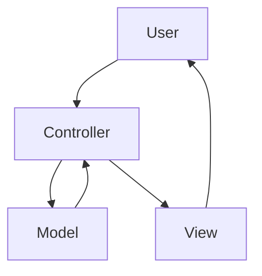

<br>

<p align="center"><a href="https://sciola-git.github.io"></a></p>

# <p align="center">:warning: Under development</p>

<br>

## <p align="center">The Lightweight PHP Framework to Accelerate Development.</p>

<br>

### :arrow_right: Requirements

- Apache2 | https://httpd.apache.org
- Composer | https://getcomposer.org
- NPM | https://www.npmjs.com
- PHP 7++ | https://www.php.net
- DBMS - (Data Base Management System) | https://en.wikipedia.org/wiki/Database

### :arrow_right: Install

1. [Download the framework here and unzip it in your development directory.](https://github.com/sciola-git/Sciola/archive/refs/heads/main.zip)

   Example: **/var/www/sciola**

2. Go to the packages directory and run the commands to do the installation:

   > **LINUX**
   >
   > debian@debian:~$ **cd /var/www/sciola/packages**
   >
   > debian@debian:~/var/www/sciola/packages$ **composer install**
   >
   > debian@debian:~/var/www/sciola/packages$ **npm install**

3. Give write permission to the directory: **/var/www/sciola/writable**

4. Access the application through the url that is configured on your web server.

   Example: http://localhost:8080

<br>

## <p align="center">Reference</p>

<br>

### :arrow_right: Directory Structure

<br>

> <a href="#-config"></a> [config](#-config)
>
> <a href="#-database"></a> [database](#-database)
>
> <a href="#-languages"></a> [languages](#-languages)
> 
> <a href="#-layers"></a> [layers](#-layers)
>
> <a href="#-libraries"></a> [libraries](#-libraries)
>
> <a href="#-packages"></a> [packages](#-packages)
>
> <a href="#-public"></a> [public](#-public)
>
> <a href="#-routes"></a> [routes](#-routes)
>
> <a href="#-tests"></a> [tests](#-tests)
>
> <a href="#-writable"></a> [writable](#-writable)

<br>

### :arrow_right: Front-end

<br>

> <a href="#-writable"></a> [CSS](#css)

<br>

##

<p>

### <a href="#-config"></a> config

</p>

In this directory are the application's configuration files.

##

**constant.ini**

> **Note** *In production change the **DEV_MODE** option to false.*

```ini
DEV_MODE = true
```

*to*

```ini
DEV_MODE = false
```

**php.ini**

> **Note** *PHP settings with **PHP_INI_ALL** permission.*

##

<p>

### <a href="#-database"></a> database

</p>

In this directory are the database development files used by the ORM (Object-Relational Mapping).

##

text...

##

<p>

### <a href="#-languages"></a> languages

</p>

In this directory are the translation files of your application and the routes.

##

> **Note**
>
> *- Translation files must have the following structure: {"ID" : "Term"}*
>
> *- The translated text must have the same ID in all translation files. Example:*


### Text translation

File: **en/app.json**

```json
{
  "A0001" : "Hello World!",
  "A0002" : "Welcome",
  "A0003" : ""
}
```

File: **pt-BR/app.json**

```json
{
  "A0001" : "Olá Mundo!",
  "A0002" : "Bem-vindo",
  "A0003" : ""
}
```

### Route translation

File: **en/routes.json**

```json
{
  "B0001" : "products-and-services",
  "B0002" : "virtual-store",
  "B0003" : "contact"
}
```

File: **pt-BR/routes.json**

```json
{
  "B0001" : "produtos-e-servicos",
  "B0002" : "loja-virtual",
  "B0003" : "contato"
}
```

> **Note** *You will be able to rename the files and create others with custom names according to the context of your application. Example:*

File: **en/system.json**

File: **en/system-routes.json**

File: **en/website.json**

File: **en/website-routes.json**

<br>

File: **pt-BR/system.json**

File: **pt-BR/system-routes.json**

File: **pt-BR/website.json**

File: **pt-BR/website-routes.json**

##

**Call the function to translate into:**

**PHP**
```php
<?php
  translate('Term in english...');
?>
```

**Twig**
```twig
{{ translate('Term in english...') }}
```

**JS**
```javascript
<script>
  translate('Term in english...');
</script>
```

<p>

### <a href="#-layers"></a> layers

</p>

MVC - [ Model | View | Controller ]

##



## Controller

File: **MyController.php**

```php
<?php

namespace Layers\Controllers;

use Framework\Controller;

class MyController extends Controller
{
    public function foo()
    {
        $model = model('MyModel');
        $data['foo'] = $model->foo();
        return view('my-view', $data);
    }
}
```

## Model

File: **MyModel.php**

```php
<?php

namespace Layers\Models;

use Framework\Model;

class MyModel extends Model
{
    private $pdo = null;
    //private $orm = null;

    public function __construct()
    {
        $this->pdo = $this->pdo();
        //$this->orm = $this->orm();
    }

    public function foo()
    {
        return 'Hello World';
    }
}
```

## View

File: **my-view.html**

```twig


<h1>Page content {{ foo }}</h1>


```

##

<p>

### <a href="#-libraries"></a> libraries

</p>

In this directory are the libraries of your application.

##

You can create your classes in this directory and call them anywhere in your application. Example:

File: **Foo.php**

```php
<?php

namespace Lib;

class Foo
{
    public function bar()
    {
        return 1;
    }
}
```

Now just instantiate the class in the controller, model or other library:

```php
<?php

use Lib\Foo;

class MyController extends Controller
{
    public function demo()
    {
        $Foo = new Foo;
        echo $Foo->bar(); // 1
    }
}
```

or

```php
<?php

use Lib\Foo;

class MyModel extends Model
{
    public function demo()
    {
        $Foo = new Foo;
        echo $Foo->bar(); // 1
    }
}
```

##

<p>

### <a href="#-packages"></a> packages

</p>

In this directory are the packages managed by [composer](https://getcomposer.org) and [npm](https://www.npmjs.com).

##

Go to the packages directory and run the commands to do the installation:

**LINUX**

debian@debian:~$ **cd /path/to/packages**

debian@debian:~/path/to/packages$ **composer install**

debian@debian:~/path/to/packages$ **npm install**

> **Note** *You can configure public packages, with access via url.*

File: **package.json**

```json
{
  "dependencies": {

  },
  "public": {
    "my-package-1": "my-package-1/dist",
    "my-package-2": "my-package-2/dist"
  }
}
```

```
Access URL:

http://localhost/packages/my-package-1/css/all.min.css
http://localhost/packages/my-package-1/js/all.min.js

http://localhost/packages/my-package-2/css/all.min.css
http://localhost/packages/my-package-2/js/all.min.js
```

##

<p>

### <a href="#-public"></a> public

</p>

In this directory are the public files served by the web servers.

##

> **Note** *This directory can be renamed according to your web server settings.*

##

<p>

### <a href="#-routes"></a> routes

</p>

In this directory are the route files - Friendly urls.

##

> **Note** *You can create multiple route files as per your application's organizational structure.*

File: **foo.php**

```php
<?php

Route::add('/', function () {
    controller('YourController')->method();
});

Route::add('/' . translate('my-route'), function () {
    controller('YourController')->method('args');
});
```

##

<p>

### <a href="#-tests"></a> tests

</p>

In this directory are the test files of your application.

##

##

<p>

### <a href="#-writable"></a> writable

</p>

This is a writable directory to store data generated by the application.

##

<br>

> ### CSS
> ---
> 
> **Font** (open-sans)
> 
> <p>&lt;p class="font-light"&gt;&lt;/p&gt;</p>
> <p>&lt;p class="font-light-italic"&gt;&lt;/p&gt;</p>
> <p>&lt;p class="font-regular"&gt;&lt;/p&gt;</p>
> <p>&lt;p class="font-italic"&gt;&lt;/p&gt;</p>
> <p>&lt;p class="font-semibold"&gt;&lt;/p&gt;</p>
> <p>&lt;p class="font-semibold-italic"&gt;&lt;/p&gt;</p>
> <p>&lt;p class="font-bold"&gt;&lt;/p&gt;</p>
> <p>&lt;p class="font-bold-italic"&gt;&lt;/p&gt;</p>
> <p>&lt;p class="font-extrabold"&gt;&lt;/p&gt;</p>
> <p>&lt;p class="font-extrabold-italic"&gt;&lt;/p&gt;</p>
> <p>&lt;p class="font-condensed-light"&gt;&lt;/p&gt;</p>
> <p>&lt;p class="font-condensed-light-italic"&gt;&lt;/p&gt;</p>
> <p>&lt;p class="font-condensed-bold"&gt;&lt;/p&gt;</p>

<br>

## Author

[Leandro Sciola](https://sciola-git.github.io/leandro-sciola)

<br>

## License

The Sciola framework is open-sourced software licensed under the [MIT license](LICENSE.md).
