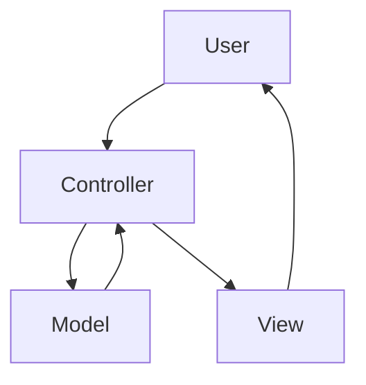

<p align="center"><a href="https://sciola-git.github.io"></a></p>

## <p align="center">The Lightweight PHP Framework to Accelerate Development.</p>

<br>

### Requirements:

- Apache2 | https://httpd.apache.org
- Composer | https://getcomposer.org
- NPM | https://www.npmjs.com
- PHP 7++ | https://www.php.net
- DBMS - (Data Base Management System) | https://en.wikipedia.org/wiki/Database

<br>

## <p align="center">Reference</p>

<br>

### :file_folder: Directory Structure

<br>

> <a href="#-config"></a> [config](#-config)
>
> <a href="#-database"></a> [database](#-database)
>
> <a href="#-languages"></a> [languages](#-languages)
> 
> <a href="#-layers"></a> [layers](#-layers)
>
> <a href="#-libraries"></a> [libraries](#-libraries)
>
> <a href="#-packages"></a> [packages](#-packages)
>
> <a href="#-public"></a> [public](#-public)
>
> <a href="#-routes"></a> [routes](#-routes)
>
> <a href="#-tests"></a> [tests](#-tests)
>
> <a href="#-writable"></a> [writable](#-writable)

<br>

##

<p>

### <a href="#-config"></a> config

</p>

In this directory are the application's configuration files.

##

> **Note** *In production change the **DEV_MODE** option in the file: **constant.ini***
```ini
DEV_MODE = true
```
*to*
```ini
DEV_MODE = false
```

##

<p>

### <a href="#-database"></a> database

</p>

In this directory are the application's configuration files.

##

text...

##

<p>

### <a href="#-languages"></a> languages

</p>

In this directory are the translation files of your application and the routes.

##

> **Note** *The translated text must have the same index in all translation files. Example:*


### Text translation

File: **en/app.json**

```json
{
  "A0001" : "Hello World!",
  "A0002" : "Welcome",
  "A0003" : ""
}
```

File: **pt-BR/app.json**

```json
{
  "A0001" : "Olá Mundo!",
  "A0002" : "Bem-vindo",
  "A0003" : ""
}
```

### Route translation

File: **en/routes.json**

```json
{
  "A0001" : "products-and-services",
  "A0002" : "virtual-store",
  "A0003" : "contact"
}
```

File: **pt-BR/routes.json**

```json
{
  "A0001" : "produtos-e-servicos",
  "A0002" : "loja-virtual",
  "A0003" : "contato"
}
```

> **Note** *You will be able to rename the files and create others with custom names according to the context of your application. Example:*

File: **en/system.json**

File: **en/system-routes.json**

File: **en/website.json**

File: **en/website-routes.json**

<br>

File: **pt-BR/system.json**

File: **pt-BR/system-routes.json**

File: **pt-BR/website.json**

File: **pt-BR/website-routes.json**

##

<p>

### <a href="#-layers"></a> layers

</p>

MVC - [ Model | View | Controller ]

##



## Controller

File: **MyController.php**

```php
<?php

namespace Layers\Controllers;

use Framework\Controller;

class MyController extends Controller
{
    public function method()
    {
        $model = model('MyModel');
        $data['foo'] = $model->foo();
        return view('my-view', $data);
    }
}
```

## Model

File: **MyModel.php**

```php
<?php

namespace Layers\Models;

use Framework\Model;

class MyModel extends Model
{
    private $pdo = null;
    //private $orm = null;

    public function __construct()
    {
        $this->pdo = Connection::pdo();
        //$this->orm = Connection::orm();
    }

    public function foo()
    {

    }
}
```

## View

File: **my-view.html**

```twig


<h1>Page content {{ foo }}</h1>


```

##

<p>

### <a href="#-libraries"></a> libraries

</p>

You can create your classes in this directory and call them anywhere in your application. Example:

##

File: **Foo.php**

```php
<?php

namespace Lib;

class Foo
{
    public function bar()
    {
        return 1;
    }
}
```

Now just instantiate the class in the controller, model or other library:

```php
<?php

use Lib\Foo;

class MyController extends Controller
{
    public function demo()
    {
        $Foo = new Foo;
        echo $Foo->bar(); // 1
    }
}
```

or

```php
<?php

use Lib\Foo;

class MyModel extends Model
{
    public function demo()
    {
        $Foo = new Foo;
        echo $Foo->bar(); // 1
    }
}
```

<br>

## License

The Sciola framework is open-sourced software licensed under the [MIT license](LICENSE.md).
