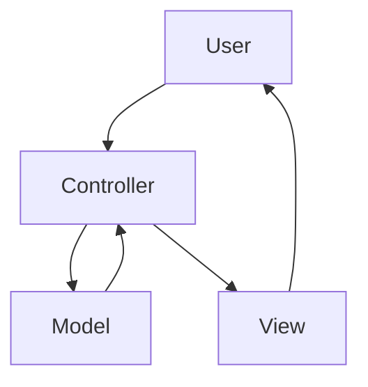

# layers

### MVC - [ Model | View | Controller ]



## Controller

File: **MyController.php**

```php
<?php

namespace Layers\Controllers;

use Framework\Controller;

class MyController extends Controller
{
    public function method()
    {
        return view('my-view');
    }
}
```

## Model

File: **MyModel.php**

```php
<?php

namespace Layers\Models;

use Framework\Model;

class MyModel extends Model
{
    public function method()
    {

    }
}
```

## View

File: **my-view.html**

```twig

<h1>Page content</h1>

```
